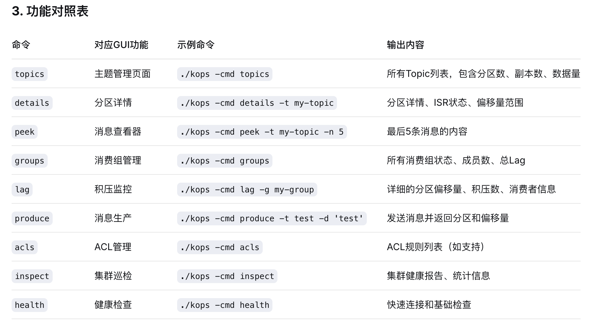

功能对照表


````
命令	        对应GUI功能	    示例命令	                                输出内容
topics	    主题管理页面	    ./kops -cmd topics	                    所有Topic列表，包含分区数、副本数、数据量
details	    分区详情	        ./kops -cmd details -t my-topic	        分区详情、ISR状态、偏移量范围
peek	    消息查看器	    ./kops -cmd peek -t my-topic -n 5	    最后5条消息的内容
groups	    消费组管理	    ./kops -cmd groups	                    所有消费组状态、成员数、总Lag
lag	        积压监控	        ./kops -cmd lag -g my-group	            详细的分区偏移量、积压数、消费者信息
produce	    消息生产	        ./kops -cmd produce -t test -d 'test'	发送消息并返回分区和偏移量
acls	    ACL管理	        ./kops -cmd acls	                    ACL规则列表（如支持）
inspect	    集群巡检	        ./kops -cmd inspect	                    集群健康报告、统计信息
health	    健康检查	        ./kops -cmd health	                    快速连接和基础检查
````

等效命令
````
curl -X GET "http://localhost:8080/topics" -H "Content-Type: application/json"

curl -X GET "http://localhost:8080/topics/my-topic/details" -H "Content-Type: application/json"

curl -X GET "http://localhost:8080/topics/my-topic/messages?limit=5" -H "Content-Type: application/json"

curl -X GET "http://localhost:8080/consumer-groups" -H "Content-Type: application/json"

curl -X GET "http://localhost:8080/consumer-groups/my-group/lag" -H "Content-Type: application/json"

curl -X POST "http://localhost:8080/topics/test/messages" -H "Content-Type: application/json" -d '{ "key": "key1", "value": "test message" }'

curl -X GET "http://localhost:8080/acls" -H "Content-Type: application/json"

curl -X GET "http://localhost:8080/cluster/inspection" -H "Content-Type: application/json"

curl -X GET "http://localhost:8080/health" -H "Content-Type: application/json"
````
